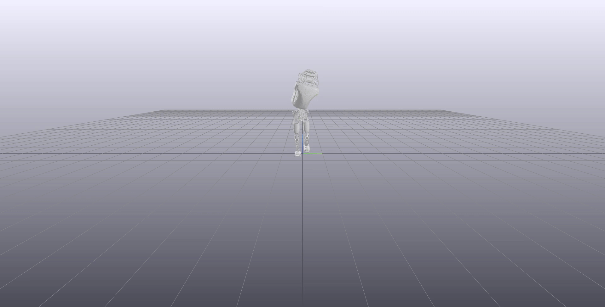

# Humanoid Locomotion

## Rough Idea
1. Given start and end position, generate sequence of footsteps
   - Footstep Planning on Uneven Terrain with Mixed-Integer Convex Optimization (Robin Deits and Russ Tedrake)
1. Given sequence of footsteps, generate ZMP trajectory (`HumanoidPlanner.py`)
   - Whole-body Motion Planning with Centroidal Dynamics and Full Kinematics (Hongkai Dai, Andrés Valenzuela and Russ Tedrake)
1. Given ZMP trajectory and footstep sequence, generate torque outputs (`HumanoidController.py`)
   - An Efficiently Solvable Quadratic Program for Stabilizing Dynamic Locomotion (Scott Kuindersma, Frank Permenter, and Russ Tedrake)
   - Roughly equivalent to [`InstantaneousQPController`](https://github.com/RobotLocomotion/drake/blob/last_sha_with_original_matlab/drake/systems/controllers/InstantaneousQPController.cpp)

## Controller
### Disturbance Rejection (Sped up 40x)
1. Launch `drake-visualizer`
   ```
   ./drake-visualizer
   ```
1. Run `python3 HumanoidController.py`

- Formulate-Solve Time: 0.04s


## Planner (WIP)
```
python3 Planner.py
```
- Takes around 40mins to solve
- Not solved to optimum (some constraints may be violated / may not be physically feasible)
  ```
  SNOPTA EXIT  80 -- insufficient storage allocated
  SNOPTA INFO  83 -- not enough integer storage
  ```
- Decapitated and dismembered to improve solve time...



## Troubleshooting

### Out of memory when building drake
In `CMakeLists.txt`, add `--jobs 4` after `${BAZEL_TARGETS}`
```
ExternalProject_Add(drake_cxx_python
  SOURCE_DIR "${PROJECT_SOURCE_DIR}"
  CONFIGURE_COMMAND :
  BUILD_COMMAND
    ${BAZEL_ENV}
    "${Bazel_EXECUTABLE}"
    ${BAZEL_STARTUP_ARGS}
    build
    ${BAZEL_ARGS}
    ${BAZEL_TARGETS}
    --jobs 4
  BUILD_IN_SOURCE ON
  BUILD_ALWAYS ON
  INSTALL_COMMAND
    ${BAZEL_ENV}
    "${Bazel_EXECUTABLE}"
    ${BAZEL_STARTUP_ARGS}
    run
    ${BAZEL_ARGS}
    ${BAZEL_TARGETS}
    --
    ${BAZEL_TARGETS_ARGS}
  USES_TERMINAL_BUILD ON
  USES_TERMINAL_INSTALL ON
)
```

### Link error on `std::filesystem` calls
Error
```
error: undefined reference to 'std::filesystem::__cxx11::path::_M_find_extension() const'
```
Use gcc 7 instead of gcc 8

### VTK problems when launching drake-visualizer
- `ModuleNotFoundError: No module named 'vtkCommonCorePython'`
- `libvtkxxx.so: No such file or directory`

In `CMakeLists.txt`, add `--define="-DUSE_SYSTEM_VTK=OFF"` after `${BAZEL_TARGETS}`

## Random Notes

### Affordable Robots
- Thormang
- Nao (~5.5k USD) (25 DoF)
- KHR-3HV (~ 2.6k USD)

### Simulation resources

#### Thormang (2019) (29 DoF)
- <https://github.com/thor-mang>
- <https://github.com/ROBOTIS-GIT/ROBOTIS-THORMANG-OPC>

#### Valkyrie R5 (2017)
- <https://github.com/osrf-migration/srcsim-wiki>
- <https://github.com/osrf/srcsim>
- <https://github.com/osrf/srcsim_docker/tree/master/docker>

#### Atlas (2016) (37 DoF)
- <https://github.com/osrf/drcsim>
- <https://github.com/osrf-migration/drcsim-wiki>

### Whole body controllers
Responsible for converting foot and body / center of mass trajectories into actual joint torques
- <https://github.com/poftwaresatent/whole_body_control>
- <https://github.com/poftwaresatent/stanford_wbc>
- <https://bitbucket.org/ihmcrobotics/ihmc_ros>
- [ControlIt!](http://sites.utexas.edu/hcrl/files/2016/01/ijhr-2015.pdf)

### Mathematical tools
#### General robot modeling and optimal control
- <https://github.com/RobotLocomotion/drake>
#### Kinematics & Dynamics
- <https://github.com/ANYbotics/kindr>
#### Trajectory optimization
Responsible for creating foot and body / center of mass trajectories given start point and end goal
- <https://github.com/ethz-adrl/towr>

### Other tools
#### Motion / Task controlling
- <https://github.com/leggedrobotics/free_gait>

#### Visualization
- <http://wiki.ros.org/xpp>
- <https://github.com/RobotLocomotion/director>
